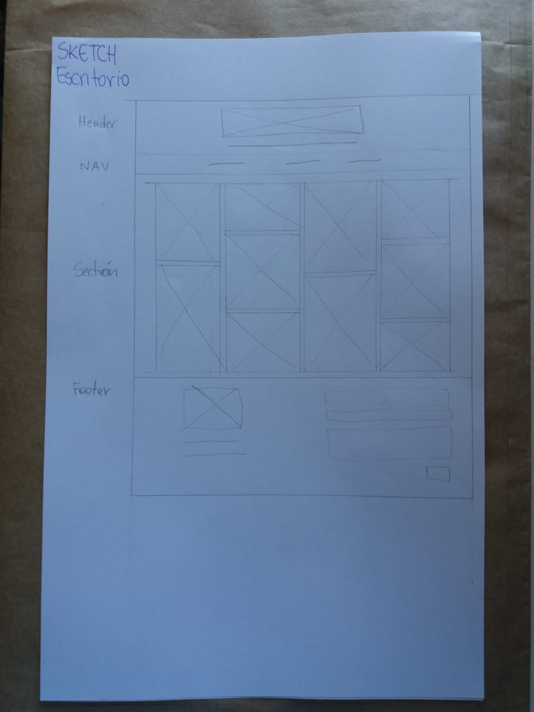
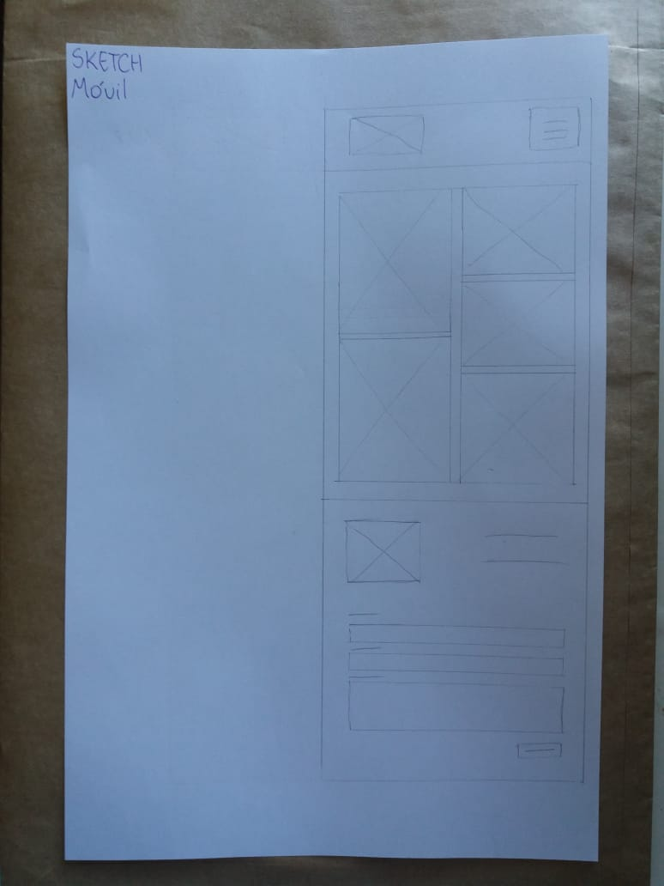

# EL_PROYECTO (Primer entregable)

## Instrucciones 1era entrega

1.Trabajar de forma individual.

2.Seleccionar un tema .

3.Crear un repositorio para el proyecto final (primer commit).

4.Crear el archivo README.md en la raíz del proyecto donde irán descripciones e instrucciones (segundo commit).

5.Crear la estructura de Directorios (tercer commit).

6.Agregar al archivo readme.md las definiciones escritas de:

    -El tema seleccionado

    -Los objetivos para la interfaz (ui) y para la experiencia del usuario (ux).

    -Los requerimientos del sitio

    -La definición de layout (tipo de página).

    -El boceto a mano (como imagen agregada al README.md y a la carpeta images del directorio (cuarto commit)

7.Realizar un Mockup del home con HTML, CSS y Bootstrap (quinto commit).

8.Versionar todo a través de GIT y gestionarlo por GitHub.

## Descripción del proyecto

Tema: Portafolio personal encuadernación "la flora"

Definición del layout: Portafolio

Objetivos para la interfaz y la experiencia de usuario:
-Que sea responsiva
-Mobile First
-Que cumpla con los estándares de HTML/CSS
-Realizar un diseño limpio y simple
-Que los elementos del sitio sean fáciles de distinguir.

###Requerimientos del sitio

Generales:

-Que sea una plataforma de difusión de los trabajos realizados
-Que predomine la imagen
-Que contenga una barra de navegación simple centrada en el viewport
-Que la sección principal sea un muestrario de imágenes de trabajos realizados.
-Formulario para contacto

Específicos:

Layout: Uso de bootstrap

Fuente: Ubuntu (google fonts)

Colores:
-fondo: #FFFFFF;
-fuente: #333333;
-destacado: #eaabab;-

imágenes:
-Uso de plugin para galeria
-Diseño modular

###Sketch escritorio y móvil

